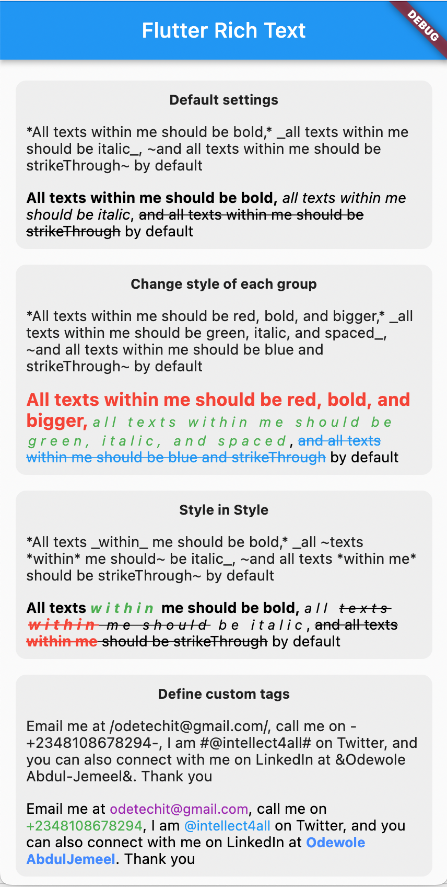

<a href="https://opensource.org/licenses/MIT">
  
</a>

A simple package for displaying beautiful and fully-customizable rich-texts easily in your Flutter apps with tags.

## Features

- Create rich text easily with \* \* for bold, \_ \_ for italics and ~ ~ for strikethrough
- Fully customizable with TextStyle
- Style-in-Style capability, that is you can next styles as deep as you need.
- You can define your own custom symbol tag and style as you wish

## Usage

add this line to pubspec.yaml

```yaml
    dependencies:
        fast_rich_text: version,
```

import package

```dart

    import 'package:fast_rich_text/fast_rich_text.dart';

```

And simply add the FastRichText widget anywhere in your app

```dart

    Widget build(BuildContext context) {
        return Scaffold(
            body: Center(
                child: FastRichText(
                    text: textForChangeStyle,
                    textStyle: const TextStyle(
                    color: Colors.black,
                    ),
                ),
            ),
        );
    }

```

You can provide custom styling for bold, italic and strikethrough as follows:

```dart

    FastRichText(
        text: textForChangeStyle,
        textStyle: const TextStyle(
            color: Colors.black,
        ),
        boldSTextStyle: const TextStyle(
            color: Colors.red,
            fontSize: 17,
            fontWeight: FontWeight.bold,
        ),
        italicTextStyle: const TextStyle(
            color: Colors.green,
            fontSize: 13,
            letterSpacing: 4,
            fontStyle: FontStyle.italic,
        ),
        strikethroughTextStyle: const TextStyle(
            color: Colors.blue,
            decoration: TextDecoration.lineThrough,
        ),
        
    ),
```
And you can define custom tags by passing a list of SymbolParams to the customSymbols field. Not that you need to set the useCustomParseSymbolsOnly to true if you want only your custom symbols to be parsed. By default, both the default and your custom symbols are parsed accordingly. Any symbol occurring more than once will select the first (in your custom symbol) and ignore the rest.

```dart

    FastRichText(
        text: textForCustomTags,
        useCustomParseSymbolsOnly: true,
        customSymbols: const [
            SymbolParams(
            symbolCharacter: '-',
            style: TextStyle(
                color: Colors.green,
                fontSize: 13,
                ),
            ),
            SymbolParams(
            symbolCharacter: '/',
            style: TextStyle(
                color: Colors.purple,
                fontSize: 13,
                ),
            ),
            SymbolParams(
            symbolCharacter: '#',
            style: TextStyle(
                color: Colors.blue,
                fontSize: 13,
                ),
            ),
            SymbolParams(
            symbolCharacter: '&',
            style: TextStyle(
                color: Colors.blueAccent,
                fontWeight: FontWeight.bold,
                fontSize: 13,
                ),
            )
        ],
        textStyle: const TextStyle(
            color: Colors.black,
        ), 
    ),

```
## FastRichText in action




## LICENSE

```

MIT License

Copyright (c) 2022 Abdul-Jemeel Odewole

Permission is hereby granted, free of charge, to any person obtaining a copy of this software and associated documentation files (the "Software"), to deal in the Software without restriction, including without limitation the rights to use, copy, modify, merge, publish, distribute, sublicense, and/or sell copies of the Software, and to permit persons to whom the Software is furnished to do so, subject to the following conditions:

The above copyright notice and this permission notice shall be included in all copies or substantial portions of the Software.

THE SOFTWARE IS PROVIDED "AS IS", WITHOUT WARRANTY OF ANY KIND, EXPRESS OR IMPLIED, INCLUDING BUT NOT LIMITED TO THE WARRANTIES OF MERCHANTABILITY, FITNESS FOR A PARTICULAR PURPOSE AND NONINFRINGEMENT. IN NO EVENT SHALL THE AUTHORS OR COPYRIGHT HOLDERS BE LIABLE FOR ANY CLAIM, DAMAGES OR OTHER LIABILITY, WHETHER IN AN ACTION OF CONTRACT, TORT OR OTHERWISE, ARISING FROM, OUT OF OR IN CONNECTION WITH THE SOFTWARE OR THE USE OR OTHER DEALINGS IN THE SOFTWARE.

```